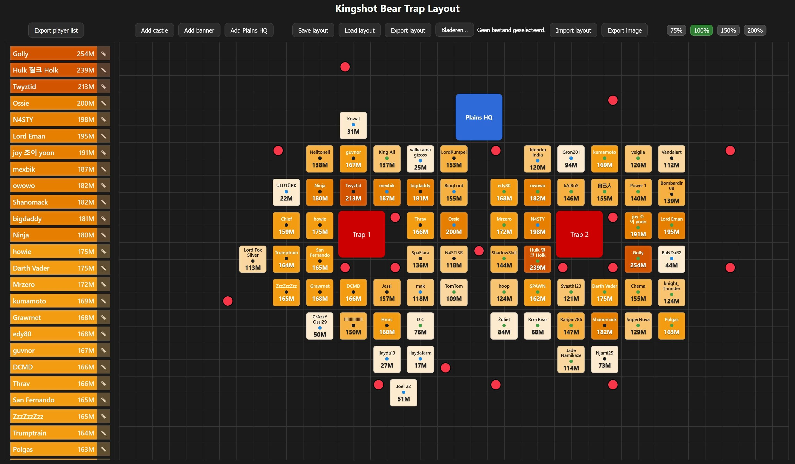

# Kingshot Bear Trap Planner

A visual planning tool for **Kingshot alliance trap events**.

This planner helps organize player positioning around bear traps and plains HQ during events by providing a grid-based drag & drop map with power-based player analysis.

---

## Live Version
🔗 **Live tool:** https://atom-d.github.io/kingshot_hive/

---

## Screenshot
<p align="center">
  
</p>

---

## Features

- Grid-based **drag & drop map**
- Place and move:
  - Castles
  - Banners
  - Plains HQ
  - Bear traps
- **Automatic player power analysis**
- Player list sorted by strength
- Visual **power tier color system**
- Trap assignment indicator on castles
- Highlight player ↔ castle selection
- Save / load layout locally
- Export / import layout JSON
- Export player list to CSV
- Zoom levels (75–200%)
- Export map as image (PNG) for easy sharing

---

## Power Tier System

Player strength is calculated relative to the **average alliance power**.

| Level | Relative Power |
|------|------|
| Exceptional | ≥150% |
| Very High | ≥130% |
| High | ≥115% |
| Medium | ≥100% |
| Low | ≥85% |
| Very Low | ≥70% |
| Poor | <70% |

Castles and player list entries are automatically colored based on this tier.

---

## Controls

### Mouse

| Action | Result |
|------|------|
| Drag | Move objects |
| Double click castle | Edit player |
| Right click | Delete object |
| Click player | Highlight castle |

---

## Layout Storage

The planner supports multiple persistence options:

- **Save layout** → browser localStorage
- **Load layout**
- **Export layout** → JSON
- **Import layout** → JSON
- **Export player list** → CSV

---

## File Structure

```
kingshot_hive
│
├─ index.html
├─ README.md
│
├─ assets
│   ├─ css
│   │   └─ style.css
│   │
│   └─ js
│       └─ planner.js
│
└─ docs
    └─ planner.jpg
```

---

## Running the Planner

Simply open `index.html` in any modern browser.

No server or installation required.

---

## Tech Stack

- Vanilla JavaScript
- HTML5
- CSS3
- Browser localStorage

No frameworks required.

---

## License

Personal project. Free to use and modify.
