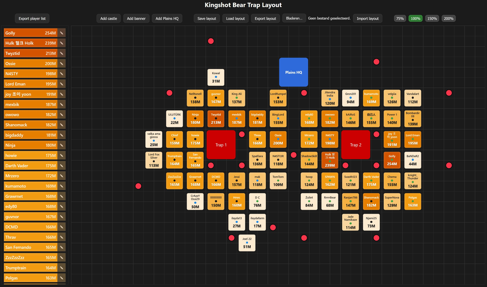

# Kingshot Hive Planner

A visual planning tool for **Kingshot alliance hive and trap events**.

This planner helps organize player and building positioning on a fully configurable grid map, with power-based player analysis, territory overlays, and flexible layout management.

---

## Live Version
🔗 **Live tool:** https://atom-d.github.io/kingshot_hive/

---

## Screenshot
<p align="center">
  
</p>

---

## Features

- Grid-based **drag & drop map**
- Place and move:
  - Castles
  - Banners
  - Plains HQ
  - Bear traps
  - Alliance Resources
  - Water tiles
  - Mountain tiles
- **Territory overlay** — banners project a 7×7 covered area, Plains HQ projects an 11×11 covered area, visualised as a light overlay on the map
- **Configurable map** — set custom width, height, and coordinate origin via Map Settings
- **X/Y coordinate axes** with origin offset (Y-axis points up)
- Click any object to **select** it and highlight its logical coordinates on the axes
- **Right-click context menu** — on an empty tile: add any object type; on an occupied tile: Edit or Delete
- **Automatic player power analysis**
- Player list sorted by strength
- Visual **power tier color system**
- Trap assignment indicator on castles
- Highlight player ↔ castle selection; click a player to scroll the map to their castle
- Smart Save for local and linked server layouts
- Publish layouts to the server with an optional password
- Open existing server layouts from the Layout Manager
- Export / import layout JSON
- Export player list to CSV
- Zoom levels (75–200%)
- Export map as image (PNG) for easy sharing

---

## Power Tier System

Player strength is calculated relative to the **average alliance power**.

| Level | Relative Power |
|------|------|
| Exceptional | ≥150% |
| Very High | ≥130% |
| High | ≥115% |
| Medium | ≥100% |
| Low | ≥85% |
| Very Low | ≥70% |
| Poor | <70% |

Castles and player list entries are automatically colored based on this tier.

---

## Controls

### Mouse

| Action | Result |
|--------|--------|
| Drag | Move objects |
| Right-click (empty tile) | Open add-object menu |
| Right-click (object) | Edit or Delete |
| Click player in list | Scroll map to their castle |

### Toolbar

| Button | Result |
|--------|--------|
| **Add ▾** | Dropdown to add any object type |
| **Save** | Saves locally and updates the linked server layout, or opens Publish for new layouts |
| **Layout ▾** | Open from server, Save As, copy share link, import/export, clear layout |
| **Map settings** | Configure width, height, and origin |
| **75% … 200%** | Zoom levels |

---

## Map Objects

| Object | Size | Notes |
|--------|------|-------|
| Castle | 2×2 | Holds player name, power, trap assignment |
| Banner | 1×1 | Projects 7×7 territory |
| Plains HQ | 3×3 | Projects 11×11 territory |
| Alliance Resource | 2×2 | No special attributes |
| Bear Trap | 3×3 | Two traps maximum |
| Water | 1×1 | Terrain marker |
| Mountain | 1×1 | Terrain marker |

---

## Coordinate System

- Origin is configurable via **Map Settings**
- X grows to the right, Y grows upward
- Object coordinates refer to the **bottom-left tile** of the object's footprint
- Axes are displayed around the map and update when origin or dimensions change

---

## Layout Storage

The planner supports multiple persistence options:

- **Save** → always writes the current layout to browser localStorage
- **First Save** on an unlinked layout opens a Publish dialog and creates a new server layout
- **Save** on a linked layout updates that same server layout directly
- **Layout Manager** → open existing server layouts, Save As a new server layout, unlink the current layout, or copy a share link
- **Export / Import layout** → JSON file via the Layout menu
- **Export player list** → CSV

Layout JSON format:
```json
{
  "_meta": {
    "serverLayoutId": null,
    "serverLayoutName": null,
    "hasServerPassword": false,
    "lastServerSync": null
  },
  "origin": { "x": 0, "y": 0 },
  "dimensions": { "w": 40, "h": 25 },
  "objects": [
    { "type": "castle", "name": "PlayerName", "power": "150M", "trap": "T1", "x": 10, "y": 8 },
    { "type": "banner", "name": "", "power": "", "trap": "F", "x": 5, "y": 5 }
  ]
}
```

---

## File Structure

```
kingshot_hive
│
├─ index.html
├─ README.md
│
├─ assets
│   ├─ css
│   │   └─ style.css
│   │
│   └─ js
│       └─ planner.js
│
└─ docs

    └─ planner.jpg
```

---

## Running the Planner

For development, run the embedded frontend through the Go server so the frontend and API are served the same way as the deployed app.

From the repository root:

```bash
make run
```

Then open `http://localhost:8080`.

For a containerized local run, use:

```bash
docker compose up --build
```

Opening `index.html` directly is still useful for static-only checks, but it is no longer the primary development path because it bypasses the embedded-frontend and same-origin API setup.

---

## Tech Stack

- Vanilla JavaScript
- HTML5
- CSS3
- Browser localStorage + Go backend API
- html2canvas (image export)

No frameworks required.

---

## License

Personal project. Free to use and modify.
